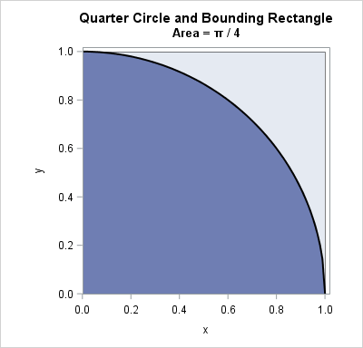

# Monte-Carlo
##### From wikipedia
Monte Carlo methods, or Monte Carlo experiments, are a broad class of computational algorithms that rely on repeated random sampling to obtain numerical results. The underlying concept is to use randomness to solve problems that might be deterministic in principle. The name comes from the Monte Carlo Casino in Monaco, where the primary developer of the method, physicist Stanislaw Ulam, was inspired by his uncle's gambling habits.

## What will we do?
We will try to use the Monte-Carlo method to calculate the value of $\pi$.
Notice: The Monte-Carlo method gives an estimation. Don't expect to get the exact value of $\pi$ when running your code.

## How will it work?
We will start with a square on an axis, and a quadrant (quarter of a circle) enclosed in it:

Now, we will "throw darts" at the square, and count the number of times we hit the inside of the semi-circle. 
Then, when we finished throwing all of our darts, we can calculate. 
As the area of the semi-circle is $\frac{\pi}{4}$, and the area of the square is 1, we can say that:
$\frac{\frac{\pi}{4}}{1} = \frac{hits\ inside\ semi-cricle}{hits\ inside\ the\ square}$
Or, if we look for the value of $\pi$, we can simple do:
$\pi = \frac{4 * hits\ inside\ semi-circle}{hits\ inside\ the\ square}$

## How do we implement it?
- Implement a function that receives the number of "darts" to throw. 
- Each dart thrown will be a set of coordinates (x,y)
  - use the random package to get these
- Check if the value is inside the semi-circle
  - think how we can do this
- If it hits inside the semi-circle, count it.
- After you threw all the darts, use the formula described above to get the value of $\pi$
